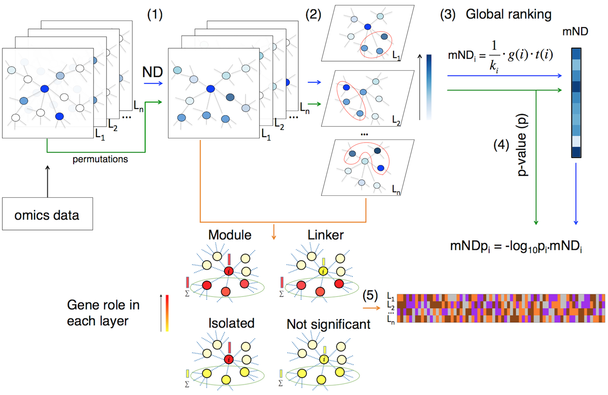

# Network analysis of multi-omics data

mND uses **m**ulti-layer **N**etwork **D**iffusion to find gene networks that contain high scoring genes. It requires two or more "layers" of genome-wide scores and an interactome.



image from: https://academic.oup.com/bioinformatics/article/36/3/865/5553095

## Documentation:

https://emosca-cnr.github.io/mND

## Citation

Di Nanni N, Gnocchi M, Moscatelli M, Milanesi L and Mosca E, *Gene relevance based on multiple evidences in complex networks*, **Bioinformatics**, Volume 36, Issue 3, 1 February 2020, Pages 865–871, https://doi.org/10.1093/bioinformatics/btz652

Contact: [Ettore Mosca](https://www.itb.cnr.it/en/institute/staff/ettore-mosca), Bioinformatics Lab, CNR-ITB

## Installation

The package requires a series of other R packages, which are available in [CRAN](https://cran.r-project.org) and [github](https://github.com). In most of the cases, the following instructions guarantee that all dependencies are installed:

```{r, eval=FALSE}
install.packages("devtools")
devtools::install_github("emosca-cnr/NPATools")
devtools::install_github("emosca-cnr/dmfind")
devtools::install_github("emosca-cnr/mND", build_vignettes = TRUE)
```

If this is not the case, please follow the instruction of the R environment and manually install the missing packages.
